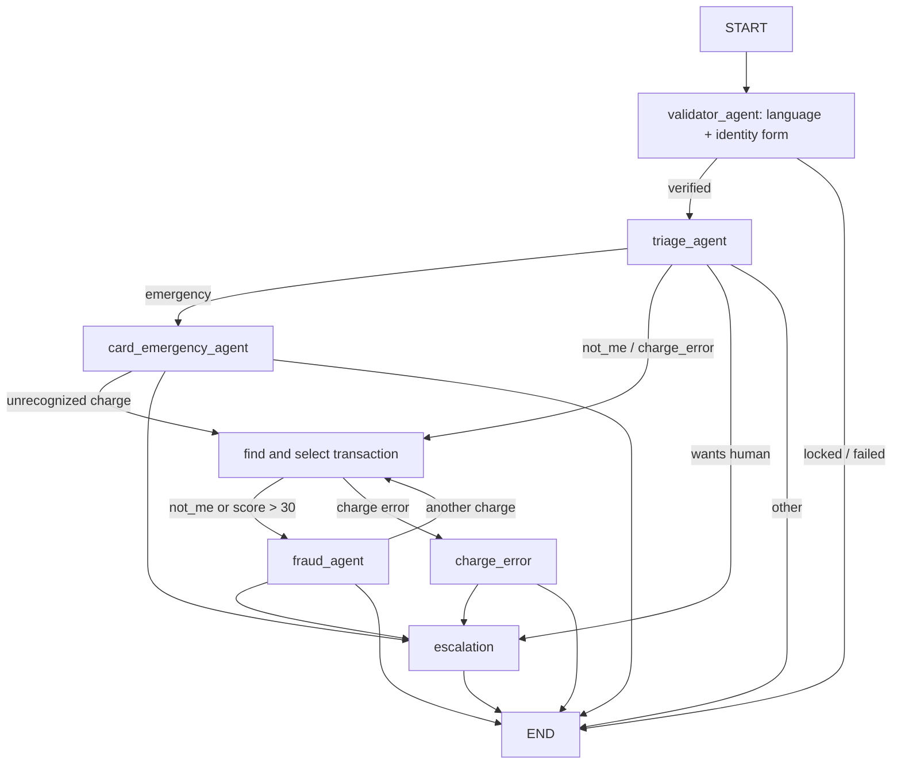

# Dispute agent (LangGraph)

The conversation agent and its web front. It verifies the customer's identity, classifies the
request (Spanish or Portuguese) and runs one of four routes: card emergency, charge error,
fraud, or escalation to a human. All data comes through the MCP server (`apps/mcp-server`);
the agent never queries BigQuery. Flow design: [state machine](../../docs/state-machine.md).

## Structure

```text
src/bank_agent/
  graphs/
    validation_triage.py   Main graph (web app, run_disputes.py --flow full)
    charge_test.py         Charge search, selection and explanation nodes
    fraud_test.py          Fraud and escalation wiring
    emergency_test.py      Card emergency wiring
    disputes.py            Older general graph (--flow legacy)
    state.py, policy.py    Conversation state; demo thresholds (single source)
  nodes/
    validator_agent/       Identity form + language detection (lingua), no LLM on identity data
    triage_agent/          LLM classifier + deterministic router and rules
    card_emergency_agent/  Select card → confirm → block and verify → ask about charges
    fraud_agent/           Protect first, then dispute; DSP-004/005/013
    charge_error/          Explanations EXP-002/003/006 and dispute policy
    escalation/            Handoff packet, narrative + claim check, ticket and notification
    common.py              Confirmations, tool calls and verification shared by nodes
  clients/                 MCP client, McpServices adapter, sessions, identity, LLM extraction
  prompts/                 Versioned prompts (no real customer data)
  web/                     Starlette app (bank-web) + static front
  observability.py         JSON-line logging
```



Each node has internal phases. Every phase change creates a checkpoint; a wait uses
`interrupt()`. There are no writes before a wait in the same phase, and the model call and the
interrupt live in separate nodes, so resuming never replays a verification or a model call.
After a resolved request the customer can ask for something else (up to 3 requests).

## Run

From the repo root, with the root `.env` filled in (see the [Quickstart](../../README.md#quickstart-run-locally)):

```bash
uv sync --project apps/agent
uv run --project apps/agent bank-web                                   # web app on :8080
uv run --project apps/agent scripts/run_disputes.py --session dev --flow full --debug   # terminal
```

`run_disputes.py --flow` also accepts `validation-triage` (default: classify only),
`charge-error`, `fraud`, `fraud-escalation`, `card-emergency`, `card-emergency-escalation` and
`legacy`. It needs `DEV_SESSIONS` only for `--session`; the identity form still runs. JSON events go
to `logs/agent.jsonl` (or `LOG_FILE`); `--debug` also logs LLM prompts and outputs (local only).

Other demos: `scripts/chat_validator.py` (conversational validator, `--mcp` for real customers),
`scripts/chat_fraud_demo.py` (card emergency + fraud agents outside the graph),
`scripts/try_triage.py` (classifier against the real LLM).

Tests: see [tests/README.md](tests/README.md).

## Nodes

**validator_agent.** The first message is not classified (it may contain identity data). The
customer fills a form: document number, date of birth, and the number of one of their products
(`products.product_number`, not `PRD-...`). The values go straight to MCP `verify_identity`; no
model sees them. On a mismatch the form returns with the remaining attempts, without saying
which field failed. Attempts, lockout and token lifetime are owned by the server and reported in
each answer. The reason for contact is asked in a new turn.

| Status | When | Next |
|---|---|---|
| VERIFIED | Document + date + a product of the customer match | triage |
| MISSING_FIELDS / INVALID_FORMAT | A field is missing or impossible (does not use an attempt) | ask again |
| FAILED | No match (generic message) | retry |
| LOCKED | 3 failures → 15 min lockout | human |
| SERVICE_UNAVAILABLE | MCP down / timeout | human |

**triage_agent.** `LLMClassifier` returns intent + confidence; `router.decide` routes in code.
Low confidence shows clarification buttons. Fraud words at any point mean `emergency`.

**card_emergency_agent.** 100% code; confirmations are buttons. One active card is chosen
automatically, several are shown by last four digits. After a verified block it offers to block
the customer's other active cards one by one (e.g. a lost wallet). Then it asks whether
there is an unrecognized charge: yes → transaction search with `intent = not_me`; no → ends
without a human. Declining the block escalates to fraud P1.

**fraud_agent.** 100% code. Protects first (offers the block if the card is not blocked yet), then
applies DSP-004 (existing case), DSP-005 (90-day window) and files the dispute after confirmation.
Asks for another charge (max 3); DSP-013 (score > 30, amount > 500 USD, or ≥ 2 charges denied)
escalates to the fraud team. Fraud on an account (not a card) escalates: there are no account tools.

**charge_error.** Pending / Reversed / Declined: saves the fixed explanation
(`save_charge_explanation`), verifies it and ends. Approved ends without a write.

**escalation.** Builds the handoff packet from verified state (queue + priority by rule), writes
a 2–3 line narrative with the LLM, checks every claim against the packet (falls back to a
template), then `create_handoff` + `notify_employee`, each verified by a read.

Thresholds (`fraud_score=30`, `high_amount_usd=500`, `window_days=90`, `max_charges=3`) live only
in `graphs/policy.py:Policy`; `config/settings.py` derives from it. They are demo values, not real
bank policies.

## Service contract

`clients/contracts.Services` is injected when building the graph; the real adapter is
`clients/mcp_services.McpServices`. Every tool call gets `session_ref`, `customer_id` and
`arguments`. `McpServices` resolves `session_ref` to the server-signed token (`sessions.py`) and
sends only the token: the server takes `customer_id` from it, never from an argument. The token is
not stored in the graph checkpoint. Operational errors or invalid answers raise `ServiceFailure`;
an expired session raises `SessionExpired`. Error messages never include sensitive data.

Tool arguments and fields are listed in the [MCP server README](../mcp-server/README.md) and
`contracts/mcp/*.json`. Amounts are decimal strings (no floats); dates are ISO with timezone.
Mutations use idempotency keys: after a timeout the same key returns the original receipt, and
each `read_*` checks the persisted effect (`verified` is true only then). The LLM extraction
(`understand`) returns intent, confidence, slots and `wants_human`; it never returns routes or an
identity, and its output is schema-validated.

## Decisions and limits

- Missing money or risk data escalates; it is never imputed. Future or timezone-less dates escalate.
- Up to 2 clarifications, 3 unrecognized charges and 8 turns (configurable).
- One retry per tool. If a handoff fails, the agent ends without announcing a successful transfer.
  The trace keeps nodes, phases and times.
- Free text never confirms an action; only authenticated buttons do.
- Sessions, conversations and the checkpointer (`InMemorySaver`) live in process memory: a restart
  requires signing in again. Production needs a persistent checkpointer and OTP or app sessions
  (document + date + product is knowledge, not possession).
- Dates like `DD/MM/YYYY` are read Latin-style, never `MM/DD`. lingua is unreliable on very short
  messages, so the previous language is kept.

Reference: [LangGraph interrupts](https://docs.langchain.com/oss/python/langgraph/interrupts).
