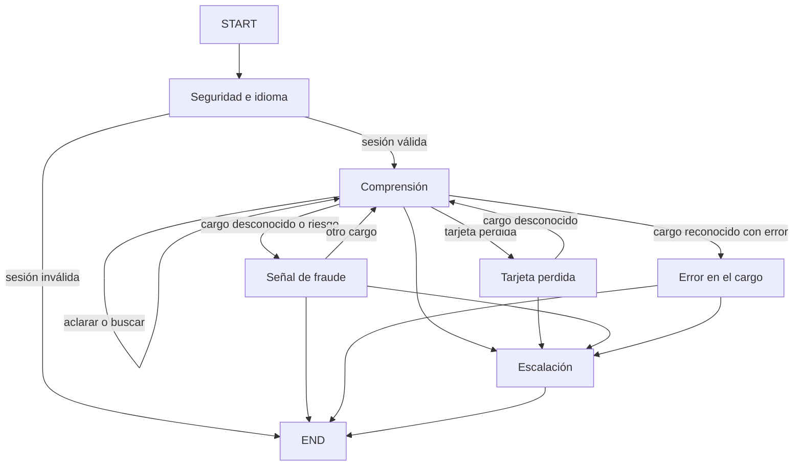

# Agente de disputas con LangGraph

Primera implementación ejecutable: seis componentes, transiciones en código y
confirmaciones mediante botones. Los servicios de pruebas son sintéticos; aún no
hay conexión a GCP, MCP o a un proveedor de modelos.

## Estructura

```text
src/bank_agent/
  graphs/state.py             Estado compartido e inicialización
  graphs/disputes.py          Grafo y controles comunes
  graphs/policy.py            Política de demostración configurable
  nodes/security_language/   1. Seguridad e idioma ES/PT
  nodes/understanding/       2. Comprensión, aclaración y búsqueda
  nodes/lost_card/           3. Tarjeta perdida o robada
  nodes/fraud/               4. Señal de fraude
  nodes/charge_error/        5. Error en el cargo
  nodes/escalation/          6. Transferencia humana
  nodes/common.py            Confirmaciones, herramientas y verificación
  clients/contracts.py       Contrato de servicios futuros
```



Cada componente es un nodo con fases internas. Cada transición de fase crea un
checkpoint; una espera usa `interrupt()`. No hay escrituras antes de una espera
en la misma fase. Los adaptadores deben garantizar idempotencia ante reejecución.

## Pruebas (desde la raíz del repositorio, con uv)

```bash
uv sync --project apps/agent --all-extras
uv run --project apps/agent pytest apps/agent -q
```

Python 3.12+, entorno propio en `apps/agent/.venv`, independiente del entorno
analítico raíz y del servidor MCP. `apps/agent/uv.lock` fija las versiones.
Las pruebas necesitan el extra `live` (langchain, lingua); no usan red ni GCP.

Pruebas de integración (`tests/integration/`, marcador `integration`): levantan el
servidor MCP real en su propio entorno y consultan BigQuery con tus credenciales
ADC, solo lectura. Se excluyen por defecto y en CI. Usan el cliente de la entrada
`dev` de `DEV_SESSIONS` (entorno o `.env` raíz), el mismo de `run_disputes.py --session dev`:

```bash
uv run --project apps/agent pytest apps/agent -m integration
```

## Integrar

```python
from langgraph.checkpoint.memory import InMemorySaver
from langgraph.types import Command
from bank_agent.graphs.disputes import build_graph
from bank_agent.graphs.state import initial_state

# services implementa clients.contracts.Services.
graph = build_graph(services, checkpointer=InMemorySaver())
config = {"configurable": {"thread_id": "conversation-123"}, "recursion_limit": 100}
result = graph.invoke(initial_state("conversation-123", "trusted-session-ref", mensaje), config)
# Presentar result['__interrupt__'][0].value en la UI.
result = graph.invoke(Command(resume={"choice": "yes"}), config)
# Aclaración de transacción: Command(resume={"text": "fecha, monto o comercio"}).
```

La aplicación debe vincular `thread_id`, `conversation_id` y `session_ref` al
usuario autenticado. Nunca aceptar estado arbitrario del navegador ni exponer
`graph.invoke` directamente. No guardar tokens en checkpoints. La sesión se
revalida antes de nodos protegidos, al recibir confirmaciones y antes de herramientas.
Usar un checkpointer persistente y protegido al desplegar; `InMemorySaver` es local.

## Ejecutar contra el servidor MCP (datos reales)

`clients/mcp_services.py:McpServices` implementa `Services` sobre `apps/mcp-server`
(solo lectura: `find_transactions`, `list_cards`, `get_card`), un LLM para
`understand` y lingua para el idioma. Bloqueos, disputas, `dispute_context` y
derivaciones aún no existen: fallan con `ServiceFailure` y el grafo termina de forma
segura (escalación o "servicio no disponible"), nunca anunciando un éxito.
`customer_id` sale siempre de la sesión; `reference_date` del reloj de escenario.

```bash
# .env en la raíz: SCENARIO_NOW, DEV_SESSIONS (solo desarrollo), LLM_MODEL, GROQ_API_KEY.
# El agente lanza el servidor con MCP_SERVER_COMMAND (uv run --project apps/mcp-server bank-mcp).
# Desde la raíz:
uv run --project apps/agent scripts/run_disputes.py --session dev --debug
```

Chat del validador de identidad (`scripts/chat_validator.py`): datos sintéticos con
`uv run --project apps/agent scripts/chat_validator.py`. Con `--bq` consulta
BigQuery directamente, sin pasar por MCP (límite conocido); la dependencia se
añade solo para esa ejecución:
`uv run --project apps/agent --with google-cloud-bigquery scripts/chat_validator.py --bq`.

`DEV_SESSIONS` asocia referencias fijas a clientes reales sin login; se reemplazará
por el validador cuando `normalize_id` conserve los guiones de los IDs reales.

## Decisiones y límites

- ES/PT: detección y extracción inyectadas mediante `Services`.
- Política demo v4: 90 días, USD 500, score 30. No son políticas bancarias reales.
  Fecha de referencia: `services.now()`. Para históricos, inyectar un reloj de
  simulación explícito. Fechas futuras o sin zona escalan.
- `amount_usd` requiere conversión verificada por el servicio; datos monetarios
  o de riesgo ausentes escalan, no se imputan.
- Hasta 2 aclaraciones, 3 cargos desconocidos y 8 turnos, configurable. Calibrar
  el límite de turnos con las evaluaciones de recorridos largos.
- Bloqueos por tarjeta y disputas por transacción; claves de idempotencia para
  mutaciones. Verificación mediante lectura posterior independiente.
- Un reintento por herramienta. Si falla la derivación, termina sin anunciar
  una transferencia exitosa. El trace conserva nodos, fases y tiempos.
- Respuestas y resumen con plantillas. Pendientes: adaptadores reales, modelo
  narrativo, claim checker, métricas de tokens/costo y detector/clasificador real.
- Petición humana en botones autenticados y comprensión. Texto libre no confirma
  acciones. La futura UI necesita un canal para nuevas emergencias durante
  cualquier pausa; hoy se detectan en entrada y aclaración de transacciones.
- No hay frontend, endpoint, Dockerfile, alertas reales ni despliegue.

Referencia: [interrupciones de LangGraph](https://docs.langchain.com/oss/python/langgraph/interrupts).
