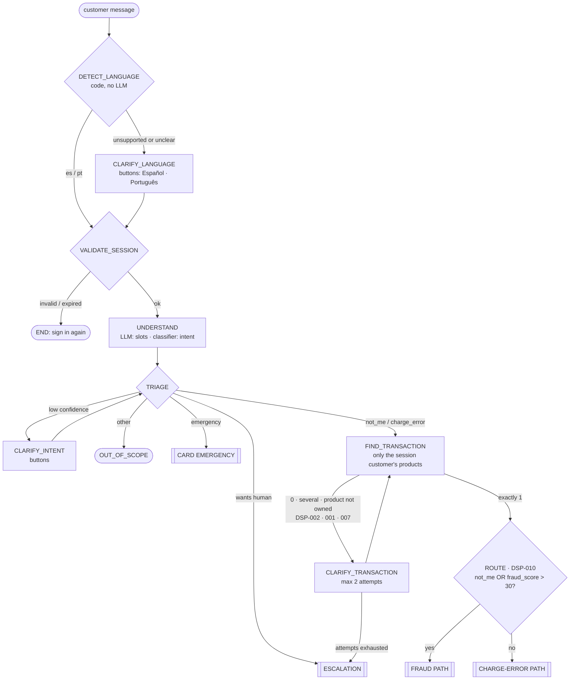
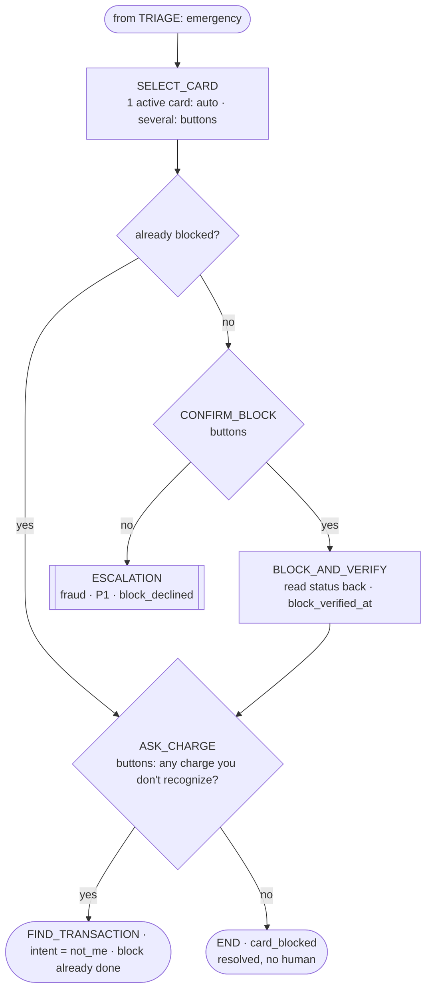
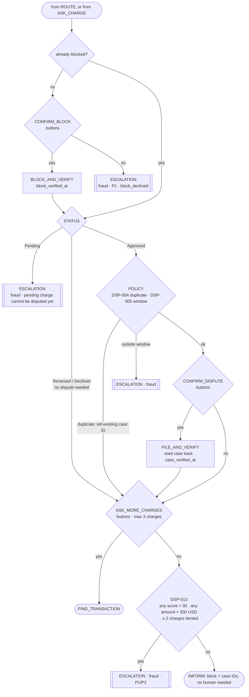
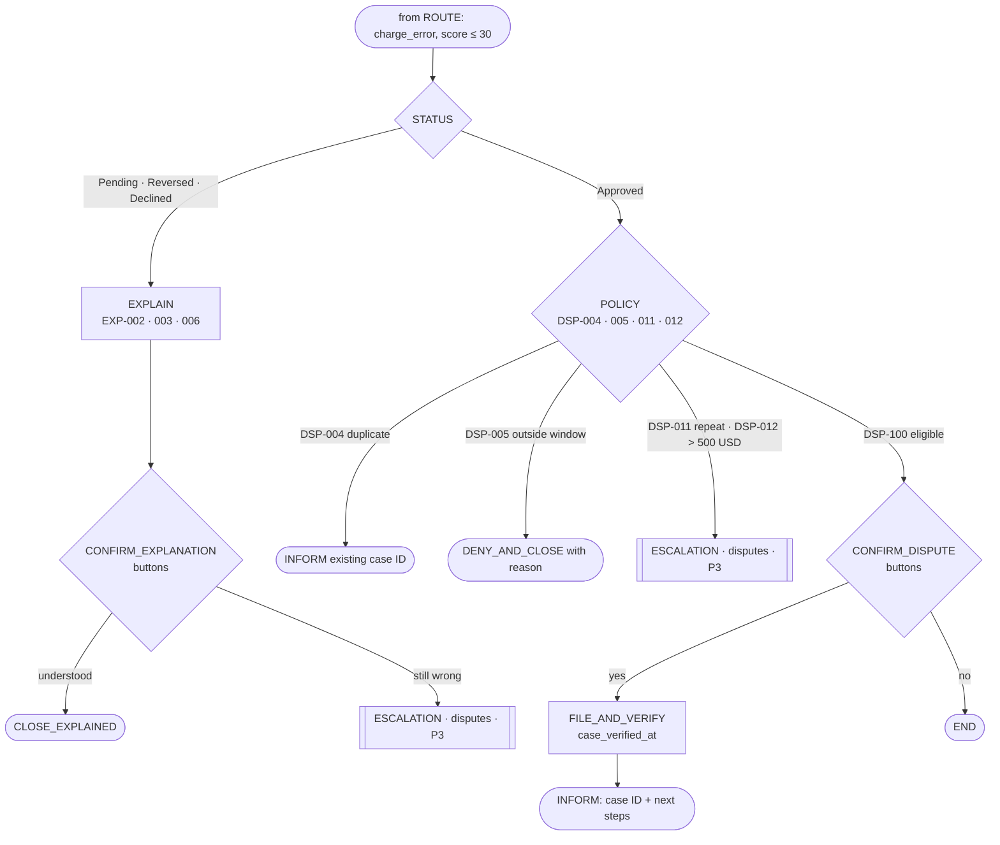
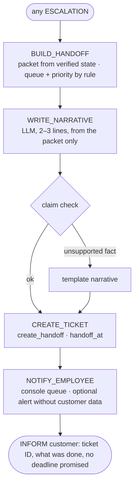

# State machine v4 — unrecognized charges, semi-autonomous fraud response, employee handoff

The state machine is the conversation script, written in code. **The LLM never chooses the next state;
code does, based on verified data.** The LLM only (a) extracts slots from the customer's words,
(b) writes customer replies and (c) writes the 2–3 line narrative of the employee summary — always from
facts the code gives it, always checked by the claim checker.

Goals it serves (see `PROBLEM.md`): **cut processing time and cost per case**, **protect the customer
immediately when it may be fraud** (semi-autonomous: the agent proposes, the customer confirms), and
**hand the employee a complete, verified summary** when a human is needed.

## What changed from v3 and why

| Change | Why |
|---|---|
| Split into one overview + three small path diagrams | v3 was one tangled diagram; each path can now be read, coded and tested on its own |
| Card emergency asks **"is there a charge you don't recognize?"** after the block | Links the emergency to a concrete transaction when there is one, instead of always escalating |
| Fraud path asks **"another charge?"** (max 3) after each one | Makes `DSP-013` "≥ 2 charges denied" reachable without the removed checklist |
| Escalation is now its own sub-flow: **queue + priority by rule → narrative → claim check → ticket → notify employee → inform customer** | Implements `HANDOFF.md` (employee summary) |
| Customer **declines the block** → P1 to the fraud team | The riskiest situation must reach a human first |
| Every state is tagged with whether it calls the LLM | Cost per case is a headline metric; the LLM runs in few states |
| Timestamps `reported_at`, `block_verified_at`, `case_verified_at`, `handoff_at` | Processing-time metrics |

## 1. Overview



**DETECT_LANGUAGE** runs on the first customer message, before anything else, so that every reply —
including "please sign in again" — is in the customer's language. It is code (a language-detection
library), not the LLM. Supported: Spanish (`es`) and Portuguese (`pt`). If the language is unsupported
or the detector is not confident, the customer picks it with buttons. The language is stored in
`ConversationState.language` and kept for the whole conversation.

## 2. Card emergency (lost / stolen)



## 3. Fraud path — protect first



## 4. Charge-error path — explain or dispute



## 5. Escalation and employee summary



## States

`LLM` = the state calls the language model (cost). Everything else is code or a UI button.

| State | Who | What it does | LLM |
|---|---|---|---|
| VALIDATE_SESSION | Code | Token exists and is not expired; log `reported_at` on the first message | – |
| UNDERSTAND | LLM + classifier | LLM extracts slots (merchant, amount, date range, product mentioned, wants_human, language). Classifier returns intent + confidence | ✅ |
| TRIAGE | Code | Routes by: wants human → emergency → not_me / charge_error → other. Low confidence → buttons | – |
| CLARIFY_INTENT | UI | Buttons: "I didn't make it" / "I made it, but it's wrong" / "I lost my card" | – |
| OUT_OF_SCOPE | Template | Says what the assistant can do; offers a human | – |
| FIND_TRANSACTION | Code | Matches merchant, amount (±10%) and date window among the customer's own products | – |
| CLARIFY_TRANSACTION | LLM + UI | Several: up to 3 buttons. None / not owned: asks date or amount without disclosing anything | ✅ |
| ROUTE | Code | `DSP-010`: fraud path if `not_me` or `fraud_score > 30` | – |
| SELECT_CARD | Code / UI | One active card → automatic; several → buttons (•••1234) | – |
| CONFIRM_BLOCK | UI | "Block card •••1234 now?" | – |
| BLOCK_AND_VERIFY | Code | `block_card`, read back, log `block_verified_at` | – |
| ASK_CHARGE / ASK_MORE_CHARGES | UI | "Is there a (another) charge you don't recognize?" | – |
| STATUS | Code | Reads `transaction_status` | – |
| POLICY | Code (`policy.py`) | Rules in order, returns decision + rule ID | – |
| EXPLAIN | LLM + claim check | Words the `EXP-xxx` explanation from the transaction record | ✅ |
| CONFIRM_EXPLANATION | UI | "Understood" / "It's still wrong" | – |
| CONFIRM_DISPUTE | UI | Summary of the charge + "File dispute" / "No" | – |
| FILE_AND_VERIFY | Code | `file_dispute`, read back, log `case_verified_at` | – |
| BUILD_HANDOFF | Code | Packet, queue and priority (table below) | – |
| WRITE_NARRATIVE | LLM + claim check | 2–3 line summary for the employee; template if a fact is unsupported | ✅ |
| CREATE_TICKET / NOTIFY_EMPLOYEE | Code | `create_handoff`; console queue; optional alert with ticket ID only | – |
| INFORM / CLOSE_EXPLAINED / DENY_AND_CLOSE | LLM + claim check | Final message: verified IDs, what happens next, no promises | ✅ |

A typical conversation calls the LLM **3–5 times**; everything else is deterministic, which is what keeps
cost per case low and every decision auditable.

## Decision tables

### Intent × transaction status

| Status ↓ / Intent → | `not_me` or score > 30 (fraud path) | `charge_error` |
|---|---|---|
| **Approved** | Block → policy → dispute → more charges? → `DSP-013` | Policy → dispute, deny or escalate |
| **Pending** | Block → escalate (cannot be disputed yet) | Explain hold (`EXP-002`) |
| **Reversed** | Block → no dispute → more charges? → `DSP-013` | Explain reversal (`EXP-003`) |
| **Declined** | Block (an attempt is a compromise signal) → no dispute → `DSP-013` | Explain decline (`EXP-006`) |

### Policy (`policy.py`) — first match wins

| ID | Condition | Outcome |
|---|---|---|
| DSP-001 | Several matching transactions | Clarify (up to 3 buttons) |
| DSP-002 | No matching transaction | Clarify (date or amount) |
| DSP-007 | Customer names a product they do not own | Clarify without disclosing anything |
| DSP-010 | `not_me`, `emergency` or `fraud_score > 30` | Fraud path |
| DSP-004 | Open dispute already exists | Tell existing case ID; no new case |
| DSP-005 | Older than 90 days (policy decision) | Charge error: deny with reason · Fraud: escalate |
| DSP-011 | ≥ 2 disputes in the last 90 days (own history) | Escalate |
| DSP-012 | Amount > 500 USD (policy decision) | Escalate |
| DSP-013 | Fraud path and (any score > 30, any amount > 500 USD, or ≥ 2 charges denied) | Escalate to fraud team |
| DSP-100 | None of the above | File dispute after confirmation |

### Explanations (`explain.py`)

| ID | Status | Customer is told |
|---|---|---|
| EXP-002 | Pending | Temporary authorization; it may disappear or post in a few days |
| EXP-003 | Reversed | Already reversed; the money is back |
| EXP-006 | Declined | Declined; no money left the account |

An explanation never closes a case by itself (the "still wrong" button is always there), and for `not_me`
the block is offered **even when the status explains the charge**.

### Escalation queue and priority (details in `HANDOFF.md`)

| Trigger | Queue | Priority |
|---|---|---|
| Customer declined the block | Fraud | **P1** |
| `DSP-013` with score > 30 or ≥ 2 charges denied | Fraud | **P1** |
| `DSP-013` with amount > 500 USD only · fraud on a Pending charge · fraud outside window | Fraud | P2 |
| Card emergency with no charge (card replacement) | Cards | P3 |
| `DSP-011`, `DSP-012`, explanation rejected | Disputes | P3 |
| Customer asked for a human · turn limit · tool failure | General | P3 (P2 if a fraud intent was detected) |

## Global rules (override the diagrams, in any state)

1. Fraud words at any point ("me robaron la tarjeta", "roubaram meu cartão") → `emergency`.
2. Customer asks for a human → ESCALATION with everything gathered so far.
3. Tool failure or timeout → retry once, then safe fallback + ESCALATION. Never report an unverified action.
4. Turn limit (~8 customer turns) → ESCALATION.
5. Session expires mid-conversation → stop and ask to sign in again.
6. All confirmations are buttons, never interpreted free text.

## Autonomy (what "semi-autonomous" means here)

| Action | Level |
|---|---|
| Look up transactions, explain Pending / Reversed / Declined | Automatic |
| Block card · file dispute | Agent proposes → customer confirms (button) → agent executes and reads back |
| Escalate and notify the employee | Automatic, by rule |
| Unblock, refund, promise money or deadlines | Never — always a human |

## Contract changes

```python
class Intent(str, Enum):
    NOT_ME = "not_me"                  # "I didn't make this purchase"
    CHARGE_ERROR = "charge_error"      # "I made it, but the charge is wrong"
    EMERGENCY = "emergency"  # lost / stolen card
    OTHER = "other"

class AgentState(str, Enum):
    VALIDATE_SESSION, UNDERSTAND, TRIAGE, CLARIFY_INTENT, OUT_OF_SCOPE,
    FIND_TRANSACTION, CLARIFY_TRANSACTION, ROUTE,
    SELECT_CARD, CONFIRM_BLOCK, BLOCK_AND_VERIFY, ASK_CHARGE, ASK_MORE_CHARGES,
    STATUS, POLICY, EXPLAIN, CONFIRM_EXPLANATION, CONFIRM_DISPUTE, FILE_AND_VERIFY,
    BUILD_HANDOFF, WRITE_NARRATIVE, CREATE_TICKET, NOTIFY_EMPLOYEE,
    INFORM, CLOSE_EXPLAINED, DENY_AND_CLOSE, DONE

# ConversationState — new / changed fields
intent: Intent | None = None
intent_confidence: float | None = None
path: Literal["fraud", "charge_error", "emergency"] | None = None
explanation_rule: str | None = None             # EXP-xxx
denied_transaction_ids: list[str] = []          # for DSP-013 and ASK_MORE_CHARGES (max 3)
block_declined: bool = False                    # → P1
reported_at: datetime | None = None
block_verified_at: datetime | None = None
case_verified_at: datetime | None = None
handoff_at: datetime | None = None
llm_calls: int = 0                              # cost per case
```

`HandoffPacket` gains `queue`, `priority`, `customer_quote`, `narrative`, `not_done`, `next_steps`,
`told_customer`, `transcript_ref` (see `HANDOFF.md`).

## Metrics each part produces

| Metric | From |
|---|---|
| Time to verified block (p50 / p95) | `block_verified_at − reported_at` |
| Time to verified case (p50 / p95) | `case_verified_at − reported_at` |
| Time to employee handoff (p50 / p95) | `handoff_at − reported_at` |
| Cost per attempted case / per resolved case | `llm_calls` × tokens + infrastructure |
| Customer-reported fraud without a block offer | Fraud-path scenarios — target 0 |
| Fraud not escalated when `DSP-013` requires it | Fraud-path scenarios — target 0 |
| Handoff summaries with all required fields and no unsupported facts | Escalation scenarios — target 100% |

## Demo cases (each in ES and PT)

| Demo case | Path |
|---|---|
| Normal resolution | `not_me`, 1 match, Approved, score 12, 40 USD → block verified → dispute filed → no more charges → `DSP-013` no → INFORM (no human; the 45% case) |
| Normal resolution (alt.) | `charge_error`, Reversed → `EXP-003` → "understood" → CLOSE_EXPLAINED |
| Ambiguous | 3 matching charges → CLARIFY_TRANSACTION buttons; or low-confidence intent → CLARIFY_INTENT |
| Human required | `not_me`, score 85 → block verified → dispute filed → `DSP-013` → P1 fraud ticket with employee summary |
| Human required (alt.) | Customer declines the block → P1 fraud ticket with `block_declined` |
