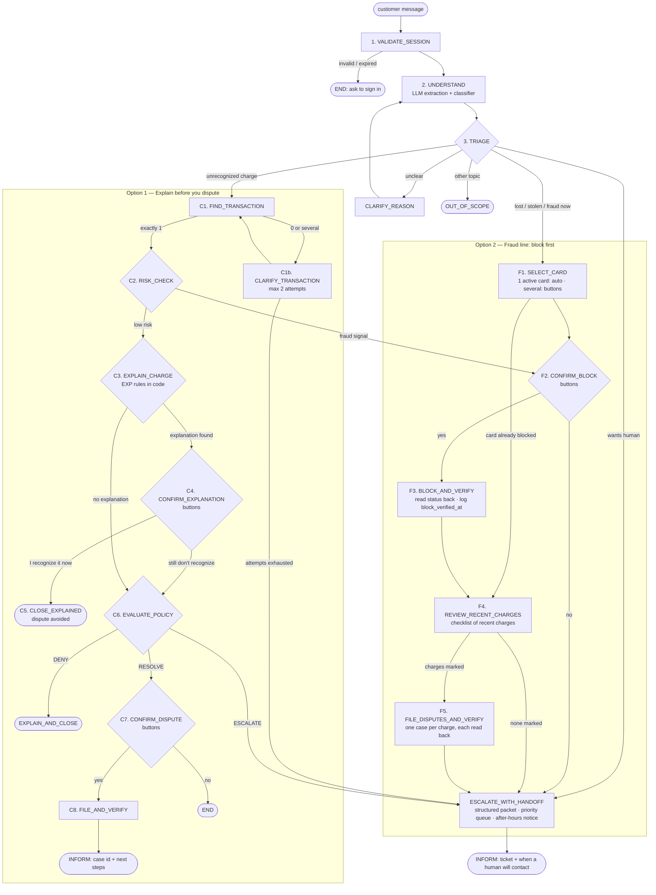

# State machine v2 — "Explain before you dispute" + "Fraud line"

**The LLM never chooses the next
state; code does, based on verified data.** The LLM only (a) extracts structured facts from thecustomer's words and (b) writes the reply from facts the code gives it.


## Diagram



## States

### Common

| State | Who | What it does | Next |
|---|---|---|---|
| **1. VALIDATE_SESSION** | Code | Token exists and is not expired | UNDERSTAND or END |
| **2. UNDERSTAND** | LLM + classifier | Extraction (JSON): intent, merchant, amount, date range, language, lost/stolen, wants_human. Classifier: dispute reason + confidence | TRIAGE |
| **3. TRIAGE** | Code | Routes by priority: human request → fraud emergency → unrecognized charge → unclear → out of scope | See diagram |
| **ESCALATE_WITH_HANDOFF** | Code + LLM (summary) | Builds the packet, files the ticket, tells the customer when a human will contact them (business hours aware) | INFORM |

### Option 2 — Fraud line (block first, investigate after)

| State | Who | What it does | Next |
|---|---|---|---|
| **F1. SELECT_CARD** | Code / UI | `list_cards`. One active card → selected automatically. Several → buttons with masked numbers (•••1234). Already blocked → skip block | CONFIRM_BLOCK or REVIEW_RECENT_CHARGES |
| **F2. CONFIRM_BLOCK** | UI (buttons) | "Block card •••1234 now?" Yes / No | BLOCK_AND_VERIFY, or ESCALATE with flag `block_declined` |
| **F3. BLOCK_AND_VERIFY** | Code | `block_card`, read status back, log `block_verified_at` | REVIEW_RECENT_CHARGES |
| **F4. REVIEW_RECENT_CHARGES** | Code / UI | Lists the card's charges from the last N days (default 14) as a checklist; customer marks the ones they don't recognize | FILE_DISPUTES_AND_VERIFY, or ESCALATE if none marked |
| **F5. FILE_DISPUTES_AND_VERIFY** | Code | One dispute per marked charge, each read back; no refund promised | ESCALATE_WITH_HANDOFF (fraud team) |

**Target:** block verified in **≤ 3 customer turns** from the first message.

### Option 1 — Explain before you dispute

| State | Who | What it does | Next |
|---|---|---|---|
| **C1. FIND_TRANSACTION** | Code | Match by merchant, amount (±10%) and date window, only in the session customer's transactions | RISK_CHECK or CLARIFY_TRANSACTION |
| **C1b. CLARIFY_TRANSACTION** | LLM (writes) | Several matches: up to 3 options as buttons. None: asks for date or amount. Max 2 attempts | FIND_TRANSACTION or ESCALATE |
| **C2. RISK_CHECK** | Code | `fraud_score ≥ threshold`, or other unrecognized charges on the same card in the last days → treat as fraud | Fraud flow (CONFIRM_BLOCK) or EXPLAIN_CHARGE |
| **C3. EXPLAIN_CHARGE** | Code (`explain.py`) | Runs the EXP rules below in order; first match returns an explanation **with evidence** (transaction IDs, dates, amounts) | CONFIRM_EXPLANATION or EVALUATE_POLICY |
| **C4. CONFIRM_EXPLANATION** | UI (buttons) | LLM words the evidence; customer picks "I recognize it now" / "I still don't recognize it" | CLOSE_EXPLAINED or EVALUATE_POLICY |
| **C5. CLOSE_EXPLAINED** | LLM (writes) + claim check | Confirms, no dispute filed. Counts as a safe resolution (dispute avoided) | END |
| **C6. EVALUATE_POLICY** | Code (`policy.py`) | Same rules as v1 (window, duplicate dispute, repeat complainer, amount) | EXPLAIN_AND_CLOSE, CONFIRM_DISPUTE or ESCALATE |
| **C7. CONFIRM_DISPUTE** | UI (buttons) | Summary + Yes / No | FILE_AND_VERIFY or END |
| **C8. FILE_AND_VERIFY** | Code | Create the case, read it back | INFORM |

## Explanation rules (`explain.py`, deterministic, each with an ID)

| ID | Explanation | Evidence the code must find |
|---|---|---|
| **EXP-001** | Recurring charge (subscription) | ≥ 2 previous charges, same merchant, amount within ±5%, roughly monthly |
| **EXP-002** | Pending authorization / temporary hold | `transaction_status = Pending` (e.g. hotel, gas station, car rental) |
| **EXP-003** | Already reversed | `transaction_status = Reversed`, or a matching reversal exists |
| **EXP-004** | Merchant name looks different on the statement | Descriptor maps to a known merchant (team-built alias table) **and** the customer has previous purchases there |
| **EXP-005** | Amount differs because of currency conversion | Charge currency ≠ account currency; amount recomputed with `daily_exchange_rates` |

Safety rules for explanations:
1. **RISK_CHECK always runs first.** A fraud signal skips explanations entirely.
2. The explanation comes **only from code**; the LLM words it and the claim check verifies every number and date.
3. The customer **always** gets the "I still don't recognize it" button. The agent never closes the case on its own.
4. The worst unsafe outcome for this flow is **false reassurance** (explaining away real fraud). It is measured explicitly in evaluation.

## Global rules (override the diagram, in any state)

1. **Fraud words at any point** ("me robaron la tarjeta", "roubaram meu cartão") → jump to SELECT_CARD.
2. **Customer asks for a human** → ESCALATE_WITH_HANDOFF with everything gathered so far.
3. **Tool failure or timeout** → retry once, then safe fallback + escalate. Never report an unverified action.
4. **Turn limit** (~8 turns without resolution) → escalate.
5. **Session expires mid-conversation** → stop and ask to sign in again.
6. **All confirmations are buttons**, never interpreted free text.

## Conversation state — additions to `ConversationState`

```python
class Flow(str, Enum):
    FRAUD = "fraud"            # Option 2
    CHARGE = "charge"          # Option 1

# new fields
flow: Flow | None = None
explanation: Explanation | None = None        # rule_id + evidence (transaction ids, amounts, dates)
flagged_transaction_ids: list[str] = []       # marked in REVIEW_RECENT_CHARGES
reported_at: datetime | None = None           # first message of the conversation
block_verified_at: datetime | None = None     # exposure-window metric
```

`Extraction` gains `intent: Literal["unrecognized_charge", "emergency", "other"]`.

## Demo cases mapped to paths

| Demo case | Option 1 path | Option 2 path |
|---|---|---|
| Normal resolution | FIND (1) → RISK low → EXPLAIN (EXP-001 subscription) → "I recognize it" → CLOSE_EXPLAINED | "Me robaron la tarjeta" → SELECT (1 card) → CONFIRM_BLOCK → BLOCK_AND_VERIFY → REVIEW (2 marked) → FILE_DISPUTES → handoff |
| Ambiguous / unsupported | FIND (3 matches) → CLARIFY_TRANSACTION → … | Customer has 2 cards → SELECT_CARD asks which one |
| Human required | FIND (1) → RISK high → fraud flow → handoff | Customer declines block → ESCALATE with `block_declined` |

## New metrics these flows enable

| Metric | Flow |
|---|---|
| Disputes avoided (explained and accepted) / all unrecognized-charge cases | Option 1 |
| False reassurance rate (explained, but ground truth = fraud) — **unsafe outcome** | Option 1 |
| Time to verified block: p50 / p95, and customer turns to block | Option 2 |
| Charges disputed per fraud case, and share filed and verified | Option 2 |

## Work this creates (for the task board)

| What | Owner |
|---|---|
| New `AgentState` values, `Flow`, `Explanation`, `Extraction.intent` in `contracts.py` | C |
| TRIAGE, fraud flow (F1–F5) and charge flow (C2–C5) in `agent.py` + tests per path | C |
| `explain.py` with EXP-001…005 + unit tests | C (B can help) |
| Tool `list_card_transactions(token, card_id, days)`; batch-safe `file_dispute` | D |
| Checklist and card-selection buttons in the UI | D |
| Mock-bank data with recurring charges, pending holds, reversals, merchant aliases, FX charges and fraud bursts | A |
| Scenarios for each path in ES and PT, including false-reassurance traps | A, B |